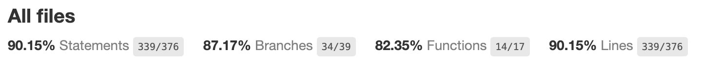

# Next.js Pet Adoption App

## Table of Contents

- [Overview](#overview)
- [Features](#features)
- [Technologies Used](#technologies-used)
- [Project Structure](#project-structure)
- [Getting Started](#getting-started)
- [Running the App](#running-the-app)
- [Running Tests](#running-tests)

## Overview

This is a Next.js application for browsing and adopting pets. The app allows users to filter pets by species, sort them by the latest added date, and view detailed information about each pet.

## Features

- **Pet Listing**: Browse a list of pets available for adoption.
- **Filtering**: Filter pets by species.
- **Sorting**: Sort pets by the latest added date.
- **Pet Details**: View detailed information about each pet.
- **Responsive Design**: The app is fully responsive and works on all devices.

## Technologies Used

- **Next.js**: A React framework for server-side rendering and static site generation.
- **React**: A JavaScript library for building user interfaces.
- **TypeScript**: A typed superset of JavaScript that compiles to plain JavaScript.
- **Tailwind CSS**: A utility-first CSS framework for rapid UI development.
- **Zod**: A TypeScript-first schema declaration and validation library.
- **Vitest**: A blazing fast unit test framework powered by Vite.
- **A11y compliance**: The app is fully accessible and following the WCGA guidelines.

## Project Structure

The project structure is organized as follows:

```
├── public
│ ├── favicon.ico
│ └── images
├── api-specs
│ ├── pet-api.json --> spec for OpenAPI
├── src
│ ├── app
│ │ ├── layout.tsx  --> app layout
│ │ ├── page.tsx    --> main page (or default page)
│ │ └── ...other files
│ ├── components
│ │ ├── Card
│ │ │ ├── index.tsx -->Card layout component
│ │ │ └── index.test.tsx
│ │ ├── Filters
│ │ │ ├── index.tsx -->Filters component
│ │ │ └── index.test.tsx
│ │ ├── ...other components
│ ├── generated --> auto generated API files (using OpenAPI)
│ ├── schemas
│ │ ├── pets.ts --> zod schema for pets
│ │ └── pets.test.ts
│ ├── services
│ │ ├── pet.service.ts  --> pet service( used to fetch data from api)
│ │ └── pet.service.test.ts
│ └── README_APP.md
├── .gitignore
├── ... other files
```

### Components

- **Card**: Displays information about a pet, including name, photo, added date, species, and availability.
- **Filters**: Provides filtering options for species and sorting by the latest added date.
- **Header**: Displays the header of the application.
- **NoPetFound**: Displays a message when no pets are found.
- **PageLayout**: Provides the base layout for the pages.

### Pages

- **src/app/page.tsx**: The main page that lists pets and includes filtering and sorting options.

### Schemas

- **pets.ts**: Defines the Zod schemas for validating pet data.

### Services

- **pet.service.ts**: Contains functions for fetching pet data from the API (with default sort on name).

### Styles

- **globals.css**: Global CSS styles for the application and add custom color for application.

## Getting Started

### Prerequisites

- Node.js (v20 or higher)
- npm or yarn

### Installation

1. Install dependencies:

```
npm install
# or
yarn install
```

> **Important:** Ensure that the generated folder exists and contains the API files. if not please run the script `npm run generate-api`.

## Running the App

### Start the development server:

```
npm run dev
# or
yarn dev
```

Open your browser and navigate to http://localhost:3000 (or running port).

## Running Tests

### Run the tests:

```
npm test
# or
yarn test
```

### Run code coverage

```
npm run test:coverage
# or
yarn test:coverage
```

### Code Coverage Report


